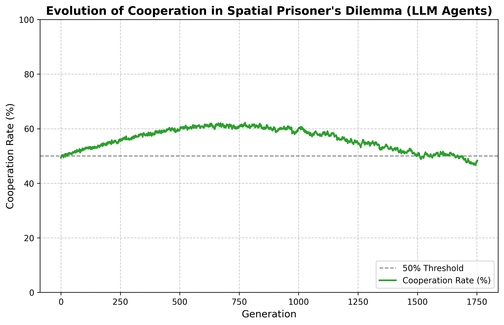

# Project Eve: LLM Agents Spatial Prisoner's Dilemma 🍎

大規模言語モデル（LLM）をエージェントとした「空間的囚人のジレンマ」の進化ダイナミクスを検証するための、JAX / vLLMベースの高速シミュレータです。

## 🌟 概要 (Overview)
本プロジェクトは、10,000体のLLMエージェントが2次元グリッド空間上で相互作用する社会シミュレーションです。
LLMの事前学習データに依存する「データ汚染（TFT戦略等の暗記）」を完全に排除するため、独自の**『構造的・数学的難読化（Structural Obfuscation）』**を実装しています。

## 🔬 コア技術：構造的難読化 (Core Mechanics)
LLMに対してゲーム理論の「利得行列」を直接与えるのではなく、以下の変換を行っています。

1. **アフィン変換による利得の隠蔽:** 正のアフィン変換を用いてスコアを偽装し、ナッシュ均衡を保ったまま「囚人のジレンマ」という文脈を隠蔽。
2. **目的関数の反転（Load Minimization）:** エージェントのタスクを「スコアの最大化」から、架空のシステム上の「負荷（Load）の最小化」へと反転。

これにより、LLMは自身の内部知識（暗記）に頼れず、純粋な論理推論のみで他者との協調・裏切りを選択せざるを得ない未知の環境（ゼロベース）に置かれます。

## 📊 初期観測データ (Initial Results)
10,000エージェントによる2,000世代のシミュレーションにおいて、以下のダイナミクス（断続平衡）が自発的に創発することを確認しました。

1. **TFT（しっぺ返し戦略）の創発による協力率の上昇**
2. **Generous TFT（確率的許し）と Pavlov（寄生）の出現によるレジームシフト（相転移）**

*(※第1400世代付近での協力率の相転移と搾取フェーズへの移行)*

## ⚙️ アーキテクチャ (Architecture)
* **物理演算・並列処理:** `JAX`
* **LLM推論エンジン:** `vLLM` / `SGLang`
* **モデル:** `Qwen 2.5 7B` (Local VRAM Inference)